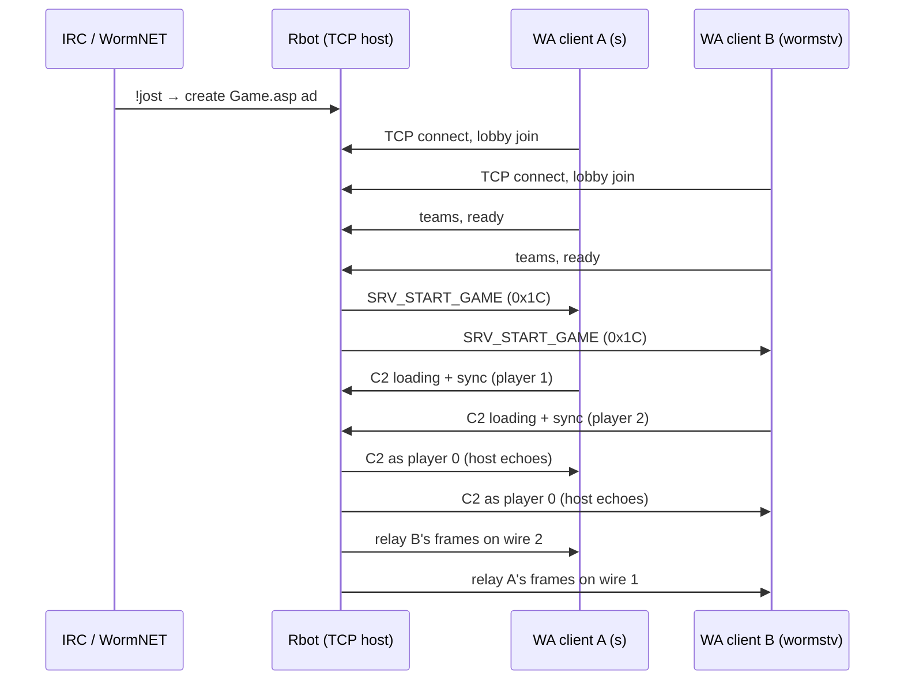

# WormNETBot network handshake and sync

This document explains how **WormNETBot (Rbot)** hosts a Worms Armageddon multiplayer session: the TCP protocol, what Rbot fakes, how two humans stay in sync, and why several subtle ID spaces must not be mixed.

It reflects the behaviour implemented in `src/wormnetbot/game_host.py` as of the **2-human Elite League** fix (May 2026).

---

## Big picture

A hosted game uses **two separate planes**:

| Plane | Transport | Rbot's role |
|-------|-----------|-------------|
| **WormNET / IRC** | IRC + HTTP `Game.asp` | Advertise game, accept `!jost`, create TCP session |
| **WA TCP session** | One TCP connection per WA client | Emulate the **lobby host** and a **virtual player 0 (Rbot)** on the game channel |

Each WA.exe client still runs its **own deterministic simulation**. Rbot does **not** run the game engine. It:

1. Answers the **lobby protocol** (channel `0x01`).
2. Starts the match with **`SRV_START_GAME` (`0x1C`)**.
3. On channel **`0x02`**, impersonates **player 0** during loading and mirrors/relays human sync traffic so all clients agree on game state.



---

## TCP packet shape

Every message on the WA TCP socket starts with a small header:

- **Lobby (channel `0x01`)**: `WA_HEADER` + body; command byte identifies message type.
- **Game (channel `0x02`)**: `WA_FRAME_HEADER`; **command byte = local wire player id** (0 = host/Rbot, 1/2 = humans in 2-player games).

Important: **`command` on channel 2 is not the global roster id.** It is **local to each WA instance** (see below).

Captures are written to `captures/*.jsonl` (one JSON object per packet/event).

---

## Three ID spaces (do not mix them)

Reverse engineering (Ghidra + live captures) showed WA uses **different identifiers** in different packets:

| Context | Field | Meaning |
|---------|--------|---------|
| **`SRV_PLAYER_LIST` (`0x0B`)** | `pre[2]` (i32) | **This client's global roster slot** — who am I on the master player list |
| **`SRV_READY` (`0x0F`)**, team owner in **`0x0C` / `0x1A`** | `player_id` | **Global roster id** (same number on every client) |
| **Channel 2 `command` byte** | wire id | **Local** per client: self sends as **1** (lower roster) or **2** (higher roster); host is always **0** |

Example in a 2-human game with **`s` = roster 1**, **`wormstv` = roster 2**:

| Client | Sees in `0x0B` “you are slot” | Sends C2 as wire | Sees peer on wire |
|--------|------------------------------|------------------|-------------------|
| **s** | 1 | 1 | wormstv → **2** |
| **wormstv** | 2 | 2 | s → **1** |
| **Both** | — | Rbot → **0** | — |

Rbot assigns stable slots via **`WORMNET_ROSTER1_NICK` / `WORMNET_ROSTER2_NICK`** (defaults: `s` → 1, `wormstv` → 2) so join order and who ran `!jost` do not swap identities.

---

## Phase 1 — IRC and session creation

1. A user runs **`!jost <scheme>`** (or similar) in IRC.
2. Rbot creates a **`GameSession`** and advertises it via **`Game.asp?Cmd=Create`**.
3. Rbot listens on **`WORMNET_GAME_PORT`** (default **17011**).
4. The **`!jost` sender** is stored as **`session_owner`** (used for roster reservation logic; pinned nicks override join-order quirks).

Humans connect their WA client to the advertised host IP/port.

---

## Phase 2 — Lobby handshake (channel `0x01`)

Each WA client performs a **two-step login**, then receives a **full lobby snapshot**.

### Step 1: `CMD_LOGIN` (`0x04`)

- Client → host: nickname, game name, version bytes.
- Host → client: **`SRV_LOGIN_OK` (`0x08`)**.

### Step 2: `CMD_LOGIN2` (`0x05`)

- Client → host: nickname, country, profile blob.
- Host allocates a **global roster id** (`player_id` 1…6; slot 0 is reserved for Rbot).
- Host → **this client only**:
  - **`SRV_PLAYER_LIST` (`0x0B`)** — full roster; **`pre[2]` = this client's roster id**
  - Scheme packet (`0x0D` custom or `0x1F` default)
  - **`SRV_RANDOM_MAP` (`0x21`)** — map seeds
  - **`SRV_TEAM_LIST` (`0x0C`)** per existing human team (owner = **global roster id**)
- Host → **other clients**: **`SRV_PLAYER_JOIN` (`0x0E`)** for the new player.
- Host → **other clients**: refreshed lobby bundle (per-peer `0x0B` again).
- Host → **everyone**: **`SRV_READY` snapshot** for all roster entries.

### What `0x0B` does

The player list body matches **`wa_playerlist`** (wabs / `wa-protocol.h`): 7×120-byte player slots + padding + trailer. The critical prefix:

```text
pre[0..1] = 0
pre[2..5] = local_machine_index (i32)  →  global roster id for *this* TCP connection
```

WA stores this in internal state (`DAT_008779e0` in 3.8.x) so F1/F2 labels, chat headers, and team ownership UI know **which row is “me”.**

**Rbot must send a different `0x0B` per connected client** (different `local_machine_index`). Broadcasting one identical list to everyone makes both clients think they are the same player.

### Teams

Humans configure teams with **`CMD_TEAM_ADD` (`0x1A`)**. Rbot:

- Stores the raw client payload.
- Sets **`team.player_id`** from the **TCP sender** (authoritative owner).
- Relays patched **`0x1A`** to peers with **global owner id** in the payload.
- Broadcasts **`SRV_TEAM_LIST` (`0x0C`)** with the same global owner.

Team **slot/colour** messages (`0x16`–`0x18`) are relayed/broadcast so all lobbies stay aligned.

### Ready bulbs (`CMD_READY` / `SRV_READY`)

- Clients toggle ready with **`CMD_READY` (`0x0F`)**.
- Rbot broadcasts **`SRV_READY`** with the **global roster id**.
- Special case: after identity fix, a client may send ready with **local id 1** in the body while its global id is 2; Rbot detects repeated ready-with-wrong-id as **toggle off** to avoid stuck green bulbs.

### Chat

- **`CMD_CHAT` / `SRV_CHAT`**: lobby chat is **relayed** to all other TCP clients (GLB lines).
- IRC **`!start`**, **`!ready`**, **`!color`** are handled by Rbot and may broadcast SYS chat.

### Start

When all humans are ready, **`!start`** (or host command) calls **`start_game()`**:

- Sends **`SRV_START_GAME` (`0x1C`)** to every client with **logic seed** and **game version** (`WORMNET_WA_START_GAME_VERSION`, default **500 / 0x1F4** for 3.8.x).
- Sets **`_game_started`** and resets loading/sync state.
- Closes the WormNET advertisement.

**Do not** re-send the full lobby bundle at start — it resets ready state and causes rapid lightbulb flicker.

---

## Phase 3 — Loading (channel `0x02`, frames `0x01`–`0x0200001B`)

After `0x1C`, each WA client enters **loading**. On a real host, **player 0** (the machine running the listen server) drives authoritative loading echoes. Rbot **simulates player 0** for each human independently.

### Per-client host ladder (Rbot → one client, wire **0**)

For each loading frame **`0x01` … `0x1A`** the human sends on **its** wire id:

1. Rbot echoes **player 0** frames **`echoed+1 … N`** to **that sender only** (body pattern `0x0AC0`, index offset).
2. When the human sends **`0x0200001B` (loading-done magic)**, Rbot echoes the same magic back on wire 0 and marks that client loading-complete.

**Never** fan the fastest client's player-0 ladder to other humans — that produces `NET_SKIPPED_PACKET` / “Index jump from Rbot”.

### Peer relay during loading (human → other human)

Rules (asymmetric on purpose):

| Frame | Relay to peer when |
|-------|---------------------|
| **`0x01`–`0x19`** | Peer **already** sent loading-done (finished loading) — so the faster client sees the slower client's full ladder |
| **`0x1A`** | Peer finished **own** player-0 ladder (`0x1A` echoed) **or** already loading-done |
| **`0x0200001B`** | Same gate as `0x1A` — **defer** if peer still mid-ladder; flush queued **`0x1A` + loading-done** in order when peer reaches `0x1A` |

**Never** relay mid-ladder frames from the faster client to the slower one while the slower client is still receiving Rbot echoes — that was the original “Waiting for other Players” desync.

### Wire id on relay

Relayed C2 must use the **receiver's local wire id** for the sender:

- On **s** (roster 1): wormstv's packets arrive on wire **2**.
- On **wormstv** (roster 2): s's packets arrive on wire **1**.

Using wire **2** for both directions (an earlier bug) made wormstv treat s's traffic as **its own wire** and break sync.

When all humans have sent loading-done, **`_loading_phase_complete`** becomes true.

---

## Phase 4 — Post-load sync (bulk `0xXX00001C`, then `0x1D`…)

After loading, each human emits a **large bulk frame** (`0x????001C`, often `0x2600001C` / `0x2B00001C`) containing compressed game state, then a **low-frame ladder** (`0x1D`, `0x1E`, … up to ~`0x26`).

Rbot (`gameplay` relay mode):

1. **Mirror as player 0 back to the sender only** — the sender expects host acknowledgement of its sync stream.
2. **Relay the same frame to peers** on the correct **local wire id**.

**Do not** mirror post-load player-0 bulk/low frames to **other** clients while they still owe their own bulk — that causes “Index jump -1 from Rbot”. Peers should receive the sender's stream **only via wire relay** until they publish their own bulk.

Both humans must send bulk + ladder for everyone to leave **“Waiting for other Players”.**

---

## Phase 5 — Gameplay relay

With **`WORMNET_GAME_C2_RELAY=gameplay`** (default):

- Every non-loading **incoming C2** frame from a human is:
  - **Host-mirrored** (player 0) back to sender after loading phase.
  - **Relayed** to other humans on the correct wire id.
- Relay stops on the real **endgame sentinel** body `40 06 00` on high enough frames (with a guard so early `0x1D` copies do not end a 2-human sync handshake).

Rbot still does **not** simulate physics; it only keeps **network indices and peer streams** consistent.

---

## What Rbot is and is not

| Rbot does | Rbot does not |
|-----------|----------------|
| TCP listen, lobby packets, roster/team/ready | Run `GameTask` / turn simulation |
| Per-client `0x0B` identity | Choose worm movement or weapons |
| `SRV_START_GAME` seeds | Compute hit results |
| Player **0** loading echoes per client | Replace client-side `NetInputCtrl` |
| C2 relay with wire translation | Guarantee winner detection (still heuristic) |

---

## Configuration knobs (identity & sync)

| Variable | Purpose |
|----------|---------|
| `WORMNET_ROSTER1_NICK` | Always roster slot **1** (default `s`) |
| `WORMNET_ROSTER2_NICK` | Always roster slot **2** (default `wormstv`) |
| `WORMNET_GAME_C2_RELAY` | `gameplay` (multi-human) or `minimal` |
| `WORMNET_WA_START_GAME_VERSION` | Trailing dword of start packet (`500` for 3.8.x) |
| `WORMNET_GAME_PORT` | TCP port (default `17011`) |

---

## Debugging

- **Logs**: `journalctl -u wormnetbot.service -f`
- **Captures**: `captures/YYYYMMDDTHHMMSSZ-<scheme>.jsonl`
  - Filter `"channel": 1` for lobby, `"channel": 2` for sync.
  - Check outbound `0x0B` — `body_hex[4:8]` little-endian = `local_machine_index`.
- **Typical errors**:
  - `Index jump from Rbot` → player-0 fan-out or loading-done injected too early.
  - `Index jump from <peer>` → missing deferred `0x1A`/loading-done or wrong relay wire id.
  - `Waiting for other Players` → peer never sent bulk; check post-load mirror/relay rules.
  - Fast lightbulb blink → full lobby rebroadcast on start (avoid).

---

## Summary timeline (2 humans, happy path)

1. **IRC `!jost`** → session + advertisement.
2. **Both join** → `0x04`/`0x05` → per-peer **`0x0B`** (s=1, wormstv=2).
3. **Teams + ready** → `0x1A` / `0x0F` broadcast.
4. **`!start`** → **`0x1C`** to all.
5. **Loading** → each client sends `0x01…0x1A`, Rbot echoes player 0; deferred peer **`0x1A` + loading-done**; finished peer gets slower peer's ladder.
6. **Post-load** → bulk `0x??00001C` + `0x1D…` from each human; Rbot mirror-to-sender + wire relay.
7. **Play** → ongoing C2 relay until endgame sentinel.

That handshake — lobby identity, asymmetric loading relay, correct wire translation, and careful player-0 mirroring — is what allows two real WA clients to treat Rbot as a host and stay locked in the same match.
